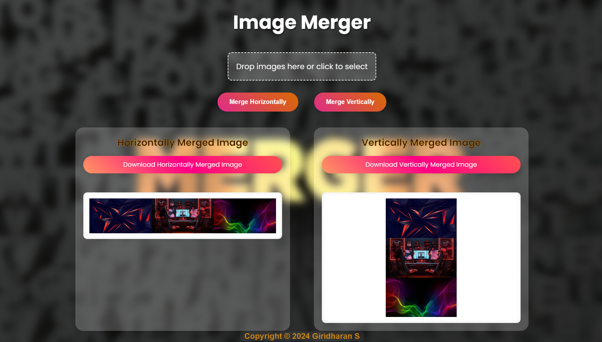

# Image Merger Web Tool

This project is a web-based tool that allows users to merge multiple images either horizontally or vertically. It supports selecting images via file input and drag-and-drop functionality.

## Features

- Merge images horizontally or vertically.
- Select images using file input.
- Drag and drop images onto the designated area (`dropZone`) for selection.
- Download the merged images.

## Technologies Used

- HTML
- CSS
- JavaScript

## Getting Started

To use the Image Merger tool locally, follow these steps:

1. Clone the repository:
   ```bash
   git clone https://github.com/GiridharanS1729/img_merger.git
   cd image-merger


## Usage

1. **Open index.html in your web browser.**

2. **Click the "Choose File" button or drag and drop images onto the "Drop images here or click to select" area.**

3. **Click either the "Merge Horizontally" or "Merge Vertically" button to merge the selected images.**

4. **After merging, download the merged image by clicking the respective "Download" button.**

## Example

Here's a brief example of how to use the Image Merger tool:

- Select or drag and drop two or more images onto the drop zone.
- Click "Merge Horizontally" or "Merge Vertically" based on your preference.
- Once the merge is complete, download the merged image by clicking the download link provided.

## Demo

You can view a live demo of the Image Merger tool [here](https://imgmrg.netlify.app).

## Screenshots


*Screenshot of the Image Merger tool interface.*

## License

This project is licensed under the MIT License - see the [LICENSE](LICENSE) file for details.

## Acknowledgments

- Icons used in this project are from [FontAwesome](https://fontawesome.com/).

## Contact

For any inquiries or feedback, please contact Giridharan S. via email at giridharans1729@gmail.com.
